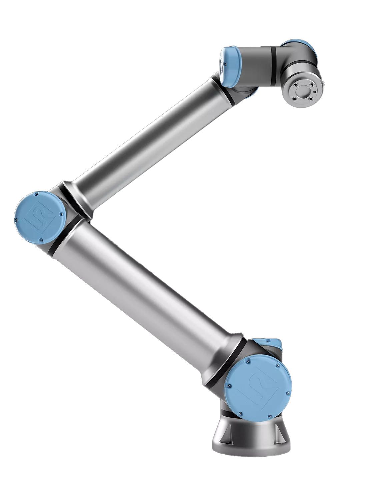
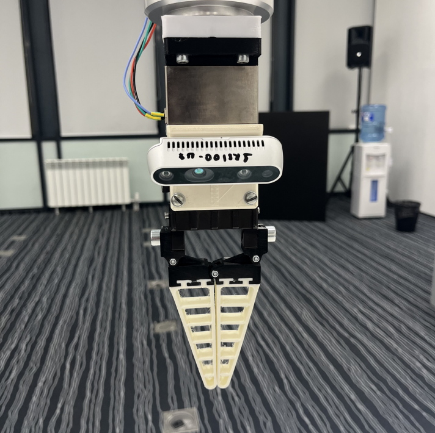

# [UR10e](docs/ur10e-product-factsheet-ru-web.pdf) robot control toolkit

  
  

## Installation

1. Requires `python3.6` or newer
2. Install dependencies: `pip install -r requirements.txt`

## Usage

`libs` contains miscellaneous algorithms and data structures
- robot control API
- camera (3D scanner) control API
- objects recognition algorithms using 3D data
- objects capture, relocation and sorting

`sims` contains solutions of computer vision tasks

`main.py` solves the following problem
&emsp;In the initial zone accessible by the robot, there are objects of two colors, objects may differ in shape. These objects are located in bulk, so they may have a random orientation and location in a given area. Their location on top of each other is also allowed. It is necessary to distribute these objects into two previously known locations. The distribution must be made based on the color. It is necessary to stack the sortable objects in the form of a tower.

 
Repo contains solutions of National Technology Olympiad final.
